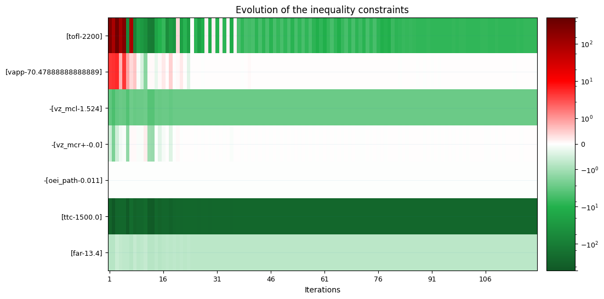
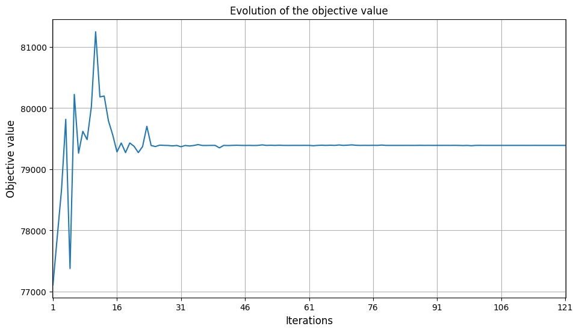
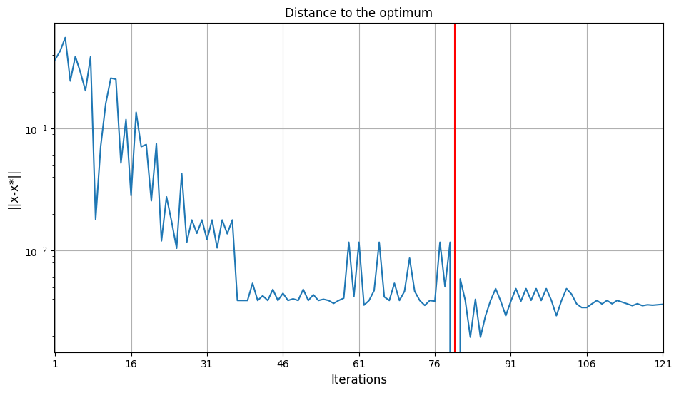

[Previous : Introduction](../report/introduction.md)

# Surrogate modeling and Optimization

Here, the objective was to find a way to minimize the maximum take-off weight `MTOW` of $f_u:x\mapsto f_u(x)=f(x,u_{\mathrm{default}})$. with $x$ the deign parameters, $u$ the technological parameters and $f$ the airplane model.

In this case, **technological parameters** are set by default to : 
1. tank gravimetric index = 0.3,
2. tank volumetric index = 0.845
3. aerodynamic efficiency factor = 1.
4. propulsion efficiency factor = 1.
5. structure efficiency factor = 1.

The **design parameters**  $x$ are :

- the engine maximum thrust  (100 kN ≤ thrust ≤ 150 kN, default: 125 kN),
- the engine bypass ratio  (BPR)  (5 ≤ BPR ≤ 12, default: 8.5),
- the wing area  (120 m² ≤ area ≤ 200 m², default: 160 m²),
- the wing aspect ratio  (7 ≤ ar ≤ 12, default: 9.5).

We can rewrite our objective as $\min_{x}(\mathbb{E}(f_u(x)_{mtow}))$ under constraints $g(x,u) \leq 0$

We aim to approximate the objective and constraints of the design problem with respect to the design parameters $x$.

In this case, using a surrogate model is very helpfull because it helps to reduce costs and time to find the optimal state of a system.

## Optimization on raw model

Firstly, we optimized the raw model to obtain the best design according to the objective (minimization of the maximum take-off weight) and the constraints.

The **operational constraints** are :

- the take off field length (TOFL ≤ 2200 m),
- the approach speed (VAPP ≤ 137 kt),
- the vertical speed MCL rating  (300 ft/min ≤ VZ_MCL),
- the vertical MCR rating  (0 ft/min ≤ VZ_MCR),
- the one engine inoperative climb path  (1.1% ≤ OEI_PATH),
- the time To climb to cruise altitude  (TTC ≤ 25 min),
- the fuselage aspect Ratio  (FAR ≤ 13.4).

We used a gradient-free method COBYLA (Constrained Optimization BY Linear Approximations) which constructs successive linear approximations of the objective function and constraints via a simplex of $n+1$ points (in $n$ dimensions), and optimizes these approximations in a trust region at each step. [More information about the optimizer](https://nlopt.readthedocs.io/en/latest/NLopt_Algorithms/#cobyla-constrained-optimization-by-linear-approximations)

However, this approach costs a lot of time : the model requires extensive computations. For our computations : optimizing the raw model took around 100 s whereas the surrogate model took around 1 s. The time reduction ratio is bigger than 100 ! That is why we then focused on a surrogate model which is cheapper to compute and runs faster.

## Design of experiment
We created an experimental design by creating a Design Space which specifies the design parameters such as `thrust`, `bypass ratio`, `area`, and `aspect ratio`, with defined lower and upper bounds.

We created a scenario using these design parameters to calculate the outputs of the original model, which is executed using a Latin Hypercube Sampling (LHS) method to gather 100 evaluations of aircraft parameters.

## Surrogate model 
Then, these samples are used to approximate the relationship between input design parameters and output objectives or constraints without repeatedly executing computationally expensive models. Here, a surrogate model is created using a Radial Basis Function (RBF) regressor trained on the dataset generated from the design of experiment.

We evaluated the performance of the surrogate model using the R2 and root mean squared error (RMSE) measures to assess both learning accuracy and cross-validation performance :
* On the train set, we have a R2 score of $1$ and RMSE measures of less than $10^{-10}$ which shows a very high accuracy.
* On the validation set, we have a R2 score higher than $0.99$ except for the one engine inoperative climb path variable which is of $0.85$. We can observe the same for the RMSE with a larger measure for the one engine inoperative climb path variable.

These metrics help confirm the model's predictive capability and generalization across unseen data.

## Optimization on surrogate

Then, we used the surrogate model in an optimization process. The optimization employs the same method (NLOPT COBYLA) we used before to adjust the design parameters with the aim of minimizing the maximum take-off weight while adhering to operational constraints.

During the optimization process, there is a balance find between minimization of maximum take-off weight and ensure inequality constraints. Let's look the evolution of inequality constraints throughout iterations of COBYLA optimizer.

We can see on this graph that first the algorithm finds a domain where constraints are valid then it minimizes the objective until constraints aren't valid. It looks like it reiterates until it converges. At the end we can see that for the green tiles, the hydrogen aircraft outperforms constraints. This means that hydrogen aircraft outperforms A320 performances.

Now, let's look the evolution of objective (maximum take-off weight) throughout iterations.

We can see that as mentioned before, the algorithm minimizes the objective when it finds a valid domain for the constraints.

Now, we can look the evolution of the distance to optimum.

We can see that the optimum is obtained at iteration 80th. This is where maximum take-off weight and constraints are the most minimized. We can note that the converges point is not the optimum point.

This optimal point correponds to an aircraft design with :
- engine maximum thrust  ~ 108.52 kN
- engine bypass ratio  (BPR)  = 12
- wing area ~ 152.97 m²
- wing aspect ratio ~ 11.05

## Errors of surrogate modeling
Finally, we visualized the errors introduced by the surrogate model and the optimization process on it.

* The error between the surrogate and the raw model for the optimal point of the surrogate $x^*_{surrogate}$ is lower than $10^{-3}$ for each output variable compared to the raw model. This shows again that the surrogate model is accurate.
* The error between the optimal point of the surrogate $x^*_{surrogate}$ and the optimal point of the raw model $x^*_{raw}$ is lower than $10^{-4}$ for each design parameter. This is again a marker of a good fit of the surrogate.

## Conclusion
Thanks to its accuracy and its fast computation, the surrogate model offers a good way to test different designs and modifications to have a reliable estimate  of objective and constraint behaviors.

Since we found an optimum minimizing the maximum take-off weight whilst ensuring operational constraints, we can see that with default values of technological parameters we can find an aircraft design for which the hydrogen aircraft outperforms A320 aircraft performances in terms of :

* take off field length which means that runways could be shorter and more airports could host hydrogen aircraft than A320
* vertical speed MCL rating which means better handling for emergency situations like anti-collisions cases
* time to climb to cruise altitude which means that hydrogen aircraft gets faster to its cruising speed and altitude which means that it travels faster than A320 aircrafts.
* fuselage aspect ratio which means that the aircraft has a more compact design ensuring more simple storage of hydrogen airplanes.

However, the maximum take-off weight is more than 3% larger than the A320 which is pretty bad. This means that even if operational constraints are achieved, the hydrogen plane cannot achieve A320 performances with the technological parameters we used.

Furthermore, our approach is based on default values of technological parameters which is not realistic. To take account of this uncertainty, we will perform a sensivity analysis in the next problem.

[Next : Problem 2, Surrogate modeling and Sensivity analysis](../report/part2.md)