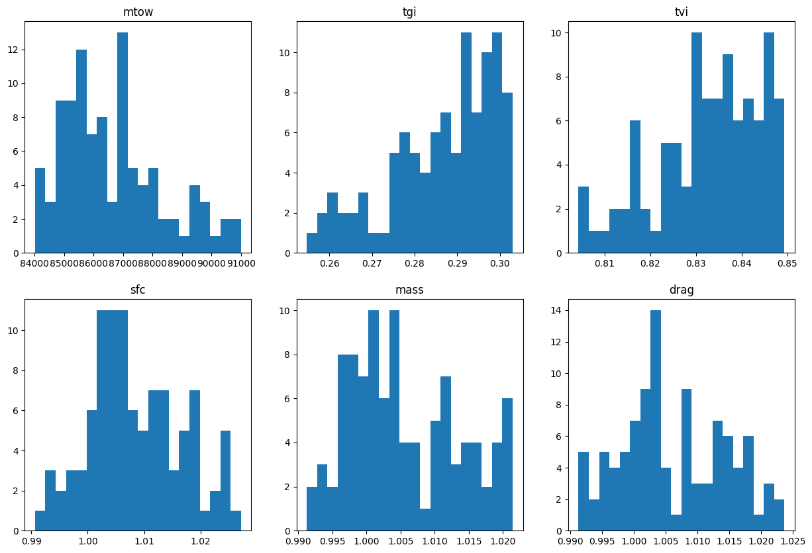

# Surrogate Modeling and Uncertainty Quantification

In the previous section, we explored the optimization of aircraft design parameters to minimize the maximum take-off weight (MTOW) using a surrogate model. Now, we turn our focus to understanding the impact of uncertainties in the technological parameters on our model's performance. This process, known as uncertainty quantification (UQ), is crucial for ensuring the robustness and reliability of our design under varying real-world conditions.

## Introduction to Uncertainty Quantification

Uncertainty quantification involves identifying and quantifying uncertainties in model inputs and their propagation through the model to assess their impact on the outputs. In our context, the technological parameters such as tank gravimetric index (tgi), tank volumetric index (tvi), aerodynamic efficiency factor (sfc), propulsion efficiency factor (mass), and structure efficiency factor (drag), which were previously set to default values, will be treated as uncertain variables.

The primary goal of UQ is to:

1. Identify the critical technological parameters that significantly influence the MTOW.
2. Quantify the uncertainty in the MTOW due to the variability in these parameters.
3. Ensure that our optimized design remains robust under these uncertainties.

## Methodology

### Airplane Initialization

First, we instantiated the H2TurboFan model and examined the input data names and output parameters of the discipline. The default input values were used to execute the discipline, and the aircraft data was printed and visualized. This step ensures we understand the baseline performance and characteristics of the aircraft model.

### Defining Uncertain Parameters

To accurately capture the variability in the technological parameters, we defined a custom parameter space that reflects the uncertainties associated with each parameter. This involved specifying the range and distribution type for each parameter based on realistic assumptions and expert knowledge.

We used triangular distributions for modeling the uncertain parameters. A triangular distribution is defined by a minimum value, a mode (most likely value), and a maximum value.

Here are the technological parameters and their respective ranges:

**Tank Gravimetric Index (tgi)**: 

   - **Minimum**: 0.25
   - **Mode**: 0.3
   - **Maximum**: 0.305
   
   The tank gravimetric index represents the weight efficiency of the tank. A lower value indicates a heavier tank, while a higher value indicates a lighter tank. The mode value of 0.3 reflects the most likely scenario based on current technological capabilities.

**Tank Volumetric Index (tvi)**:

   - **Minimum**: 0.8
   - **Mode**: 0.845
   - **Maximum**: 0.85
   
   The tank volumetric index measures the space efficiency of the tank. A value closer to 1 implies better space utilization. The mode value of 0.845 indicates the typical efficiency expected in current designs.

**Specific Fuel Consumption (sfc)**:

- **Minimum**: 0.99
- **Mode**: 1.0
- **Maximum**: 1.03

Specific fuel consumption is a measure of the fuel efficiency of the propulsion system. The mode value of 1.0 suggests the expected efficiency, with slight variations to account for possible improvements or degradations.

**Mass Efficiency Factor (mass)**:

   - **Minimum**: 0.99
   - **Mode**: 1.0
   - **Maximum**: 1.03
   
   The mass efficiency factor indicates the structural efficiency of the aircraft. The mode value of 1.0 represents the baseline efficiency, with the range accounting for potential structural improvements or increases in mass.

**Drag Efficiency Factor (drag)**:

   - **Minimum**: 0.99
   - **Mode**: 1.0
   - **Maximum**: 1.03
   
   The drag efficiency factor measures the aerodynamic efficiency of the aircraft. The mode value of 1.0 denotes the expected aerodynamic performance, with the range reflecting possible variations due to design changes or environmental factors.

By defining these parameters with their respective ranges and distributions, we ensure that our uncertainty quantification process captures the inherent variability and provides a realistic assessment of the model's performance under different scenarios.

### Sampling and Data Collection

Monte Carlo sampling was employed to generate a dataset of 100 samples for MTOW and the uncertain parameters. This approach provided a broad distribution of possible outcomes, allowing us to capture the impact of uncertainties comprehensively.

### Statistical Analysis

We computed the mean and variance of the dataset to understand the distribution of the uncertain parameters and the Maximum Take-Off Weight (MTOW). 

Here are the results of the statistical analysis:

 **MTOW**:
   **Mean**: 86645.60
   **Variance**: 2870535.72
  
  The mean MTOW value indicates the average expected take-off weight, while the variance shows the extent of variation due to the uncertainties in the input parameters.

 **Tank Gravimetric Index (tgi)**:
   **Mean**: 0.2866
   **Variance**: 0.00015
  
  The mean tgi is close to the mode value of 0.3, reflecting the expected weight efficiency of the tank, and the low variance suggests a minor spread around this mean.

 **Tank Volumetric Index (tvi)**:
   **Mean**: 0.8327
   **Variance**: 0.00013
  
  The mean tvi is close to the mode value of 0.845, indicating a typical tank space efficiency, with a low variance indicating limited variability.

 **Specific Fuel Consumption (sfc)**:
   **Mean**: 1.0085
   **Variance**: 0.000068
  
  The mean sfc slightly exceeds the mode value of 1.0, suggesting a slight deviation in fuel efficiency, with a small variance showing limited spread around the mean.

 **Mass Efficiency Factor (mass)**:
   **Mean**: 1.0057
   **Variance**: 0.000064
  
  The mean mass efficiency is close to the mode value of 1.0, indicating a minor deviation in structural efficiency, and a low variance reflects limited variability.

 **Drag Efficiency Factor (drag)**:
   **Mean**: 1.0061
   **Variance**: 0.000068
  
  The mean drag efficiency is slightly above the mode value of 1.0, reflecting a small deviation in aerodynamic efficiency, with a low variance indicating a minor spread around the mean.

These results illustrate the impact of technological parameter uncertainties on the aircraft's performance, particularly on the MTOW. The low variance values for the parameters suggest that the uncertainties do not significantly affect the overall distribution, ensuring reliable predictions of aircraft performance.

### Sensitivity Analysis

#### Model analysis using Sobol method
Using the Sobol method, we conducted a sensitivity analysis to assess the influence of uncertain parameters on the Maximum Take-Off Weight (MTOW). The results, presented in a plot with box plots for each parameter, highlight both first-order and total-order Sobol indices.

The plot reveals the following insights based on the Sobol indices means:

**Tank Gravimetric Index (tgi):**

  - The first-order mean of 1.6 suggests a moderate direct impact on MTOW.
  - A total-order mean of 1 indicates significant interaction effects with other parameters, enhancing its overall influence beyond direct contribution.

**Specific Fuel Consumption (sfc):**

  - With a first-order mean of 0.5, sfc demonstrates a notable direct effect on MTOW.
  - The total-order mean close to 0 and a small range (0 to 0.2) indicate that sfc primarily affects MTOW through direct effects rather than interactions with other parameters.

**Mass Efficiency Factor (mass):**

  - A first-order mean of 0.4 indicates a moderate direct influence on MTOW.
  - The total-order mean near 0 and a range around zero (-0.2 to 0.2) suggest that mass contributes to MTOW variance mainly through interactions with other factors.

**Tank Volumetric Index (tvi):**

  - Similar to mass, tvi has a first-order mean of 0.4, indicating a moderate direct impact on MTOW.
  - The total-order mean around 0 and a narrow range (0 to 0) suggest that tvi influences MTOW variance primarily through interactions with other parameters.

**Drag Efficiency Factor (drag):**

  - With a first-order mean of 0.2, drag shows a relatively lower direct impact on MTOW compared to other parameters.
  - The total-order mean slightly negative (-0.2) and a narrow range (-0.3 to -0.2) indicate that drag's influence on MTOW variance is predominantly through interactions with other factors, potentially mitigating their effects.

These findings provide a clear ranking of parameter importance for optimizing MTOW. Parameters like tgi and sfc have significant direct impacts, while mass, tvi, and drag primarily influence MTOW through complex interactions with other factors. This analysis guides further optimization efforts by emphasizing adjustments in parameters with higher direct impacts to achieve effective reductions in MTOW.

#### Surrogate Model Analysis using Sobol method

In this section, we extended our analysis using a surrogate model and performed a Sobol index analysis to evaluate the influence of uncertain parameters on MTOW. The updated box plot presents the following insights alongside the previous findings:

**Tank Gravimetric Index (tgi):**

  - The first-order mean decreased to 0.95 from 1.6 in the raw model analysis, indicating a slightly reduced direct impact on MTOW.
  - However, the total-order mean remained relatively high at 0.9, suggesting significant interaction effects with other parameters similar to the raw model.

**Specific Fuel Consumption (sfc):**

  - The first-order mean of 0.5 was consistent with the raw model analysis, indicating a consistent direct effect on MTOW.
  - Similarly, the total-order mean remained around 0.05, emphasizing sfc's primary influence through direct effects rather than interactions with other parameters.

**Mass Efficiency Factor (mass):**

  - Both first-order and total-order means were consistent with the raw model analysis, indicating a stable influence on MTOW primarily through interactions with other factors.

**Tank Volumetric Index (tvi)** and **Drag Efficiency Factor (drag):**

  - Both parameters showed minimal impact on MTOW in the surrogate model, with first-order and total-order means close to zero. This suggests that their influence on MTOW variance is negligible, primarily due to their limited direct effects and interactions with other parameters.

These findings from the surrogate model provide insights into the robustness of parameter impacts on MTOW, highlighting any deviations or stability compared to the raw model analysis. They reinforce the importance of certain parameters like tgi and sfc in direct MTOW optimization efforts while reaffirming the limited role of tvi and drag in influencing MTOW variance.

#### Model analysis using Morris method

In this section, we employed the Morris method to analyze the sensitivity of uncertain parameters on MTOW, comparing results between the original model and the surrogate model.

##### Original Model Analysis

Using the Morris method, we plotted sensitivity indices where the x-axis represents the *mu* parameter and the y-axis represents *sigma*. The coordinates of sensitivity indices for each parameter were as follows:

**Tank Volumetric Index (tvi):** 

  - *mu* = 20, *sigma* = 23

**Mass Efficiency Factor (mass):** 

  - *mu* = 75, *sigma* = 21

**Specific Fuel Consumption (sfc):** 

  - *mu* = 70, *sigma* = 25

**Drag Efficiency Factor (drag):** 

  - *mu* = 60, *sigma* = 26

**Tank Gravimetric Index (tgi):** 

  - *mu* = 47, *sigma* = 320

##### Surrogate Model Analysis

Interestingly, the surrogate model yielded identical sensitivity indices to the original model, confirming the robustness of parameter sensitivities across both models. The plots for both the original and surrogate Morris methods showed consistent patterns, indicating that the surrogate accurately captured the sensitivity of parameters on MTOW.

These results underscore the reliability of the surrogate model in representing parameter sensitivities, providing a validated framework for further optimization and uncertainty quantification studies. The similarity in sensitivity indices between the original and surrogate models reinforces the surrogate's efficacy in practical applications where computational efficiency is critical.

