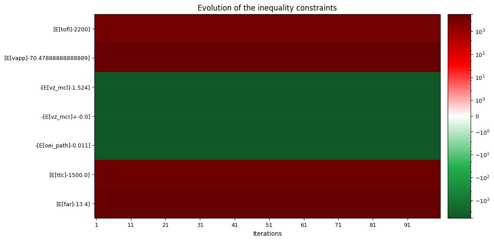
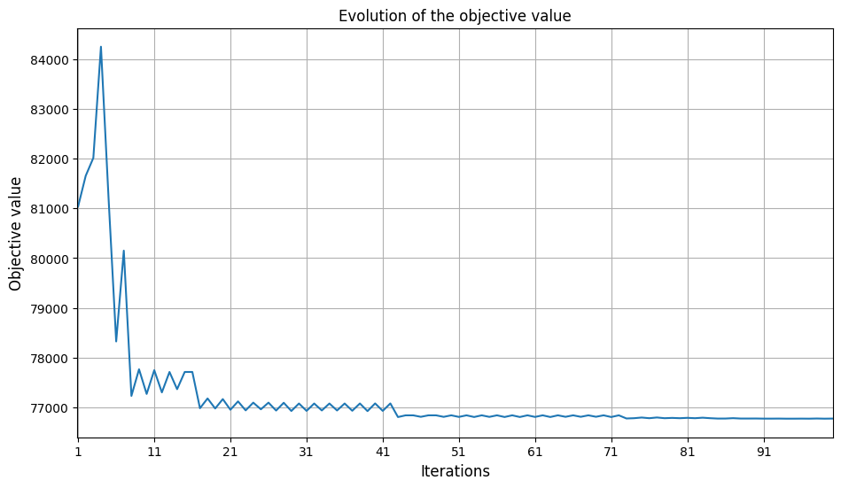
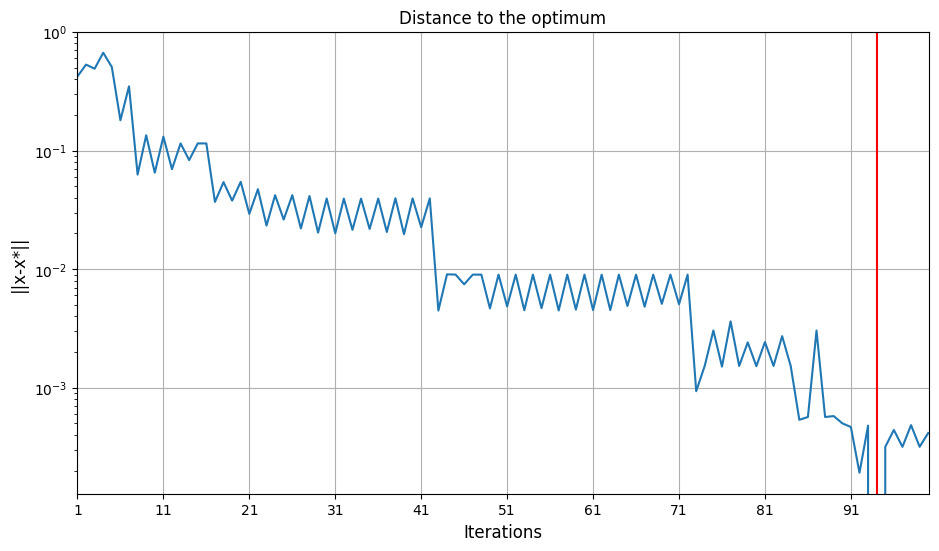

[Previous : Problem 2, Surrogate modeling and Sensivity analysis](../report/part2.md)

# Surrogate modeling and Robust Optimization

Here, the objective was to find a way to minimize the maximum take-off weight `MTOW` of $g:x\mapsto g(x, u)=f(x,u)$. with $x$ the deign parameters, $u$ the technological parameters and $f$ the airplane model.
We want to use robust optimization to prove that hydrogen airplane could achieve A320 performances knowing the distribution of technological advancements represented by technological parameters $u$.
We can formulate our problem as $\min_{x}(\mathbb{E}[f(x)_{mtow}])$ under the constraints $\mathbb{E}[g(x,u)]+k. \mathbb{S}[g(x,u)]$ with g the constraints, $\mathbb{S}$ the standard deviation operator and $k$ the quantile of $g(x,u)$. In our case, we want a 95% confidence level so $k=2$.

We used the same design parameters and operational constraints as in [Problem 1](../report/part1.md), we also used the same uncertain parameters distributions as in [Problem 2](../report/part2.md).

## Optimization on raw model

Our first approach was to optimize the raw model to obtain the best design according to the objective (minimization of the maximum take-off weight) and the constraints. We used the SLSQP (Sequential Least-Squares Quadratic Programming : it is nonlinearly constrained gradient-based) optimizer with 50 iterations. Those computations took more than 3 hours with the raw model. With a surrogate, this optimization process takes around 30 minutes, that is why we only deal with surrogate model in this report.

## Surrogate model
### Sampling
We created an design of experiment by creating a Design Space which specifies the design parameters and technological parameters such as `thrust`, `bypass ratio`, `area`, and `aspect ratio`, with defined lower and upper bounds.

We created a scenario using these design parameters to calculate the outputs of the original model, which is executed using a Latin Hypercube Sampling (LHS) method to gather 100 evaluations of aircraft parameters.

### Fit model
Then we created a surrogate model using a Radial Basis Function (RBF) regressor trained on the dataset generated from the design of experiment.

### Evaluation
We evaluated the performance of the surrogate model using the R2 and root mean squared error (RMSE) measures to assess both learning accuracy and cross-validation performance :
* On the train set, we have a R2 score of $1$ and RMSE measures of less than $10^{-10}$ which shows a very high accuracy.
* On the validation set, we have a R2 score higher than $0.95$ except for the take off field length variable which is of $0.85$ and the time To climb to cruise altitude which is of $0.66$ . We can observe the same for the RMSE with a larger measure for those two variables.

These metrics help confirm the model's predictive capability and generalization across unseen data except for time To climb to cruise altitude.

## Optimization on surrogate
Then, we used the surrogate model in an optimization process. The optimization employs the same method (NLOPT SLSQP) we used before to adjust the design parameters with the aim of minimizing the maximum take-off weight while adhering to operational constraints. This time, we take into account the uncertainty of technological parameters and we optimize over uncertain distributions.

During the optimization process, there is a balance to find between minimization of maximum take-off weight and ensure inequality constraints. Let's look the evolution of inequality constraints throughout iterations of SLSQP optimizer.

We can see on this graph that first the algorithm does not find a domain where the empirical means of constraints are valid accros the uncertain parameters distribution.

Now, let's look the evolution of objective (maximum take-off weight) throughout iterations.

We can see that as mentioned before, the algorithm minimizes the objective when it finds a valid domain for the constraints.

Now, we can look the evolution of the distance to optimum.

We can see that the optimum is obtained at iteration 80th. This is where maximum take-off weight and constraints are the most minimized. We can note that the converges point is not the optimum point.

This optimal point correponds to an aircraft design with :
- engine maximum thrust  ~ 108.52 kN
- engine bypass ratio  (BPR)  = 12
- wing area ~ 152.97 m²
- wing aspect ratio ~ 11.05

## Conclusion

[Next : Conclusion](../report/conclusion.md)
